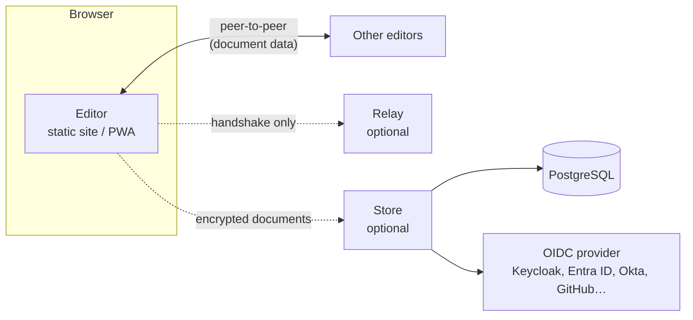

# Engineers Notebook

Diagram your architecture, capture the requirements behind it, and plan the work to build it, all in one place, collaboratively, without handing your data to a third party.

**[Open the editor](https://jbraunsmajr.github.io/system-design)** · **[Documentation](https://jbraunsmajr.github.io/system-design/docs)** · **[Self-hosting guide](https://jbraunsmajr.github.io/system-design/docs/deployment/self-host)**

## Why this exists

Most teams keep architecture diagrams in one tool, requirements in another, and planning in a third, and the links between them live in people's heads. This editor keeps them connected: a box on a diagram can point at the requirement that justifies it, and a requirement can show you every component that implements it.

It is built for teams that can't put their designs in someone else's cloud. The editor runs entirely in the browser, collaboration is peer-to-peer, and everything the project provides for servers is optional, self-hosted, and designed to work in restricted or air-gapped networks.

## Features

- **Diagrams**: a node-based canvas for system and architecture diagrams, with a component library, icons, and custom shapes.
- **Requirements traceability**: link diagram components to requirements, and look up a requirement's components in reverse. Export requirements as print-ready PDF documents.
- **Planning**: Program Increment (PI) planning with capacity reservations, sprint planning, team views, milestones and a timeline, and a dependency view of work items.
- **Presentations**: build step-by-step "scenarios" on a diagram and present them like slides.
- **Real-time collaboration**: edit together, peer to peer. Document data flows directly between browsers.
- **Offline and installable**: works as a PWA, with documents stored locally in the browser.
- **Optional team store**: an end-to-end encrypted document store with single sign-on, for teams that want shared workspaces that outlive any one browser.

## How it fits together

Only the editor is required. Add the other pieces as you need them.



| Component  | Needed for                  | What it sees                                                                     |
| ---------- | --------------------------- | -------------------------------------------------------------------------------- |
| **Editor** | Everything                  | Your documents, in your browser only                                             |
| **Relay**  | Real-time collaboration     | Only the initial handshake between browsers; it is out of the path once connected |
| **Store**  | Shared, persistent workspaces | Encrypted blobs it cannot read, plus who is signed in                          |

With no relay configured, collaboration is disabled. With no store configured, nothing leaves the browser.

## Quick start

### Just use it

Open the [hosted editor](https://jbraunsmajr.github.io/system-design). Your documents stay in your browser.

### Run the editor with Docker

```bash
docker run -d -p 8080:80 \
  -e RELAY="wss://relay.example.com" \
  -e APP_URL="https://design.example.com" \
  ghcr.io/jbraunsmajr/system-design:latest
```

Both variables are optional. See [docs/container-configuration.md](docs/container-configuration.md) for the full reference, Compose examples, and reverse-proxy setup.

### Add collaboration

Start a relay:

```bash
docker run -d -p 4444:4444 ghcr.io/jbraunsmajr/system-design-relay:latest
```

Then either set **Collaborate → Relay Server URL** to `ws://localhost:4444` in the editor, or bake in a default at build time:

```bash
VITE_SIGNALING_URL="wss://relay.example.com" npm run build
```

[docs/relay-server.md](docs/relay-server.md) covers TLS, access control, STUN/TURN, isolated networks, and troubleshooting.

### Try the full stack

A complete example with the editor, relay, store, PostgreSQL, and Keycloak:

```bash
cd docker/store
docker run --rm -u $(id -u):$(id -g) -v ./keys:/keys \
  ghcr.io/jbraunsmajr/system-design-store:latest \
  generate-recovery-key --out /keys/recovery
docker compose -f compose.yaml up --build
```

Open <http://localhost:8088> and sign in as `demo` / `demo`.

> This demo uses a placeholder client secret, a demo account, a throwaway database password, and plain HTTP. Read [docs/store-deployment.md](docs/store-deployment.md) before deploying it for real, including how to handle the recovery key.

## Published images

| Image                                          | Purpose                     |
| ---------------------------------------------- | --------------------------- |
| `ghcr.io/jbraunsmajr/system-design`            | The editor (nginx, static)  |
| `ghcr.io/jbraunsmajr/system-design-relay`      | Collaboration relay         |
| `ghcr.io/jbraunsmajr/system-design-store`      | Encrypted workspace store   |

## Development

Requires Node.js 26 (matching CI).

```bash
npm install
npm run dev        # editor at http://localhost:5173/system-design/
npm run build      # editor + docs site, output in dist/
npm run preview    # serve the production build locally
```

Pushing to `main` builds and deploys to GitHub Pages. For a first-time setup on a fork, set **Settings → Pages → Source** to **GitHub Actions**. The Vite `base` in `vite.config.ts` is `/system-design/` to match the repo name; update it if you rename the repo.

### Stack

- React + TypeScript, built with Vite
- [React Flow](https://reactflow.dev/) (`@xyflow/react`) for the canvas
- [Yjs](https://yjs.dev/) for conflict-free collaborative editing, over WebRTC
- [VitePress](https://vitepress.dev/) for the documentation site (`docs-site/`)
- Node.js + PostgreSQL for the optional store (`store/`)

### Repository layout

| Path          | Contents                                                        |
| ------------- | --------------------------------------------------------------- |
| `src/`        | The editor                                                      |
| `store/`      | The optional store: service, schema (`schema.sql`), `openapi.yaml` |
| `docker/`     | Images, nginx config, and the full-stack Compose example        |
| `docs/`       | Operator docs kept in the repo                                  |
| `docs-site/`  | The published documentation site                                |
| `scripts/`    | Test runner, verification suites, and operational tools         |
| `fixtures/`, `baselines/` | Performance test workloads and their baselines      |

## Testing

```bash
npm test                    # all suites, in parallel
npm test -- store           # only suites whose path contains "store"
npm test -- --jobs=4        # cap concurrency (or TEST_JOBS=4)
npm test -- --serial        # one at a time
```

Suites are the `*.verify.ts` files under `src/` and the `scripts/verify-*.ts` scripts. Browser suites need Playwright's Chromium (`npx playwright install chromium`). Suites that need PostgreSQL or Keycloak skip themselves unless `DATABASE_URL` or the Keycloak settings are provided (see `.github/workflows/test.yml` for the exact variables).

Performance regressions are gated in CI. See [docs/performance-testing.md](docs/performance-testing.md) for the harness and `npm run test:perf:local` to run it yourself.

## License

[AGPL-3.0](LICENSE)