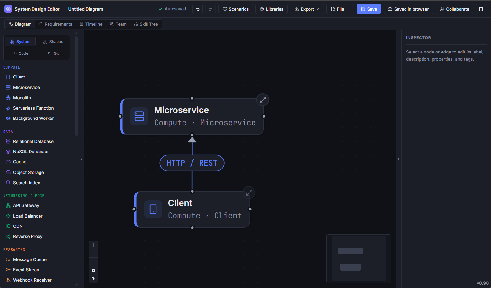
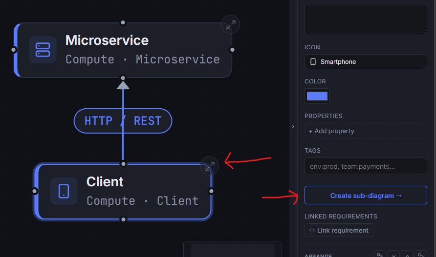
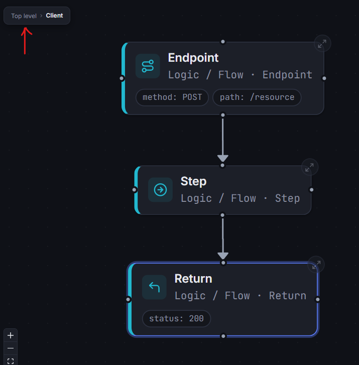
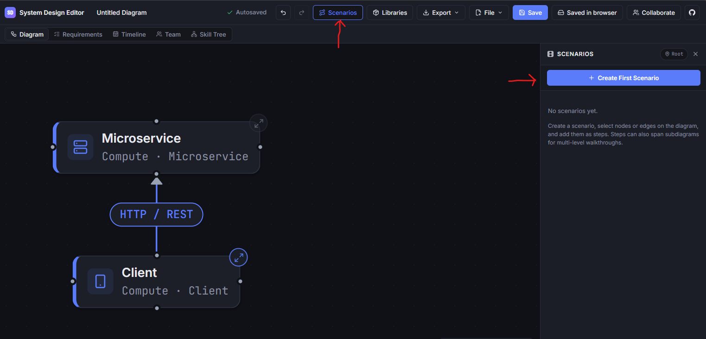
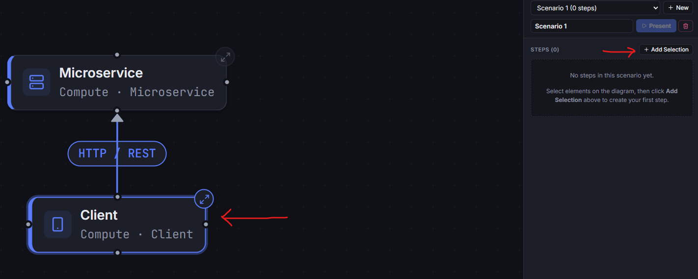
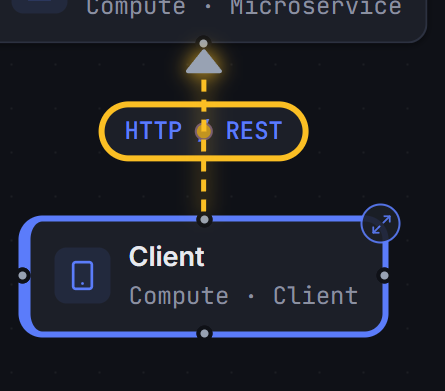
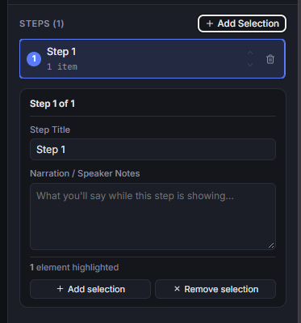
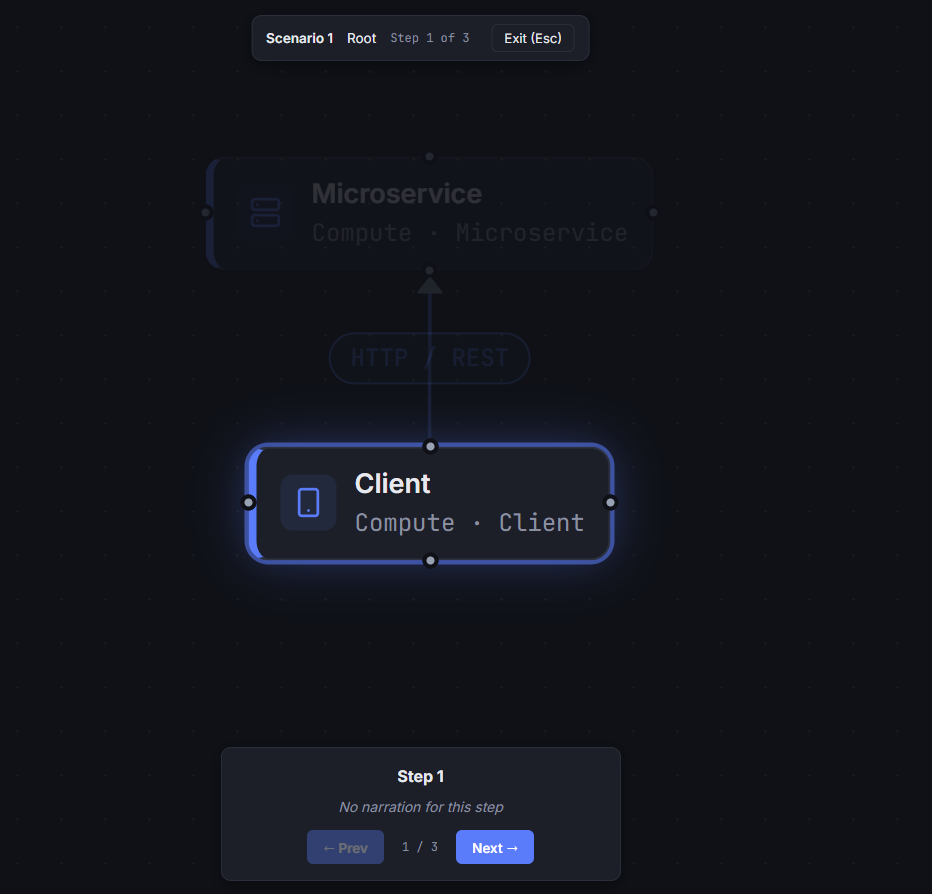
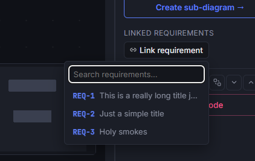

# Diagrams

The **System Design Editor** provides an interactive canvas tailored for architectural modeling, multi-tier system
visualization, and technical presentations. It combines the familiar drag-and-drop ergonomics of tools like Draw.io with
deep architectural primitives, hierarchical sub-diagrams, and dynamic presentation scenarios.

---

## 1. Canvas & Modeling Basics

The editor is designed for rapid, low-friction diagramming with zero configuration.

### Adding Components & Shapes

- **Palette**: Drag nodes and components directly from the left sidebar onto the canvas.
- **Architectural Nodes**: Choose from pre-configured system components (Microservices, Databases, Caches, Gateways,
  Message Queues, Clients, and Compute nodes).
- **Geometric Shapes**: Insert standard geometric shapes (Rectangles, Rounded Rectangles, Cylinders, Diamonds, Hexagons,
  and Cloud boundaries) for custom flowcharts and structural grouping.
- **Annotations & Snippets**: Add text callouts, sticky notes, and formatted code snippets to document decisions
  in-place.

### Connecting & Routing Edges

- **Handles**: Hover over any node boundary and drag from connection handles to link elements.
- **Edge Types & Styles**: Customize connection pathways as directional, bi-directional, solid, dashed, or dotted.
- **Waypoints**: Click and drag mid-points on connection lines to insert bends and cleanly route edges around
  intervening components.
- **Flow Direction**: Set edge flow semantics, which dynamically drive data-flow animations during scenario playback.

### Inspection & Customization

Select any component or edge to open the **Inspector Panel** on the right:

- **Labels & Descriptions**: Provide human-readable titles and markdown descriptions.
- **Icon Overrides**: Choose from the bundled Lucide icon catalog to match your exact technology stack.
- **Visual Styling**: Customize node accent colors, border styles, and Z-index layering.
- **Custom Properties & Tags**: Attach arbitrary key-value metadata and tags for categorizing systems.
- **Requirement Linking**: Bi-directionally link diagram elements directly to engineering requirements for traceability.

---

## 2. Hierarchical Sub-Diagrams (Drill-Down)

Complex systems quickly become unreadable when flattened onto a single canvas. The sub-diagram engine allows you to
model high-level architectures at the root while encapsulating low-level implementation details in nested layers.

### How to Use Sub-Diagrams

1. **Creating a Sub-Diagram**:
    - Select any architectural node on the canvas.
    - In the right-hand Inspector panel, click **Create sub-diagram →** (or **Open sub-diagram** if one exists).

2. **Editing Nested Layers**:
    - The canvas transitions into the isolated sub-diagram view.
    - Add nodes, edges, and annotations specific to that component's internal architecture.

3. **Breadcrumb Navigation**:
    - A persistent breadcrumb bar at the top of the canvas (`Root › Service A › Worker Pool`) tracks your current
      abstraction level.
    - Click any breadcrumb segment to jump directly back to higher levels.

4. **Hierarchy Management**:
    - Deleting a parent node cleanly cascades and removes its underlying sub-diagram structure.

---

## 3. Scenarios & Presentation Mode

Static diagrams often fail to convey runtime execution order, request lifecycles, or failure failover paths. The
**Scenarios** feature turns diagrams into interactive, step-by-step presentations.

### Creating a Scenario

1. Click **Scenarios** (film icon) in the top toolbar or bottom tray to open the **Scenario Panel**.
2. Click **+ New Scenario** and give your scenario a descriptive title (e.g., *"User Authentication & Token Refresh
   Flow"* or *"Payment Processing with Circuit Breaking"*).
3. Click **Add Step** to create a presentation sequence. Any selected node and edge wil be added to the step.

4. Click **Add Selection to Step** to add the currently selected nodes and edges to the step. The selected items will
   highlight in the diagram to make it clear what would be added.

### Configuring Scenario Steps

For each step in the sequence:

- **Title & Narration**: Add an explanatory title and detailed speaker notes / walkthrough narration.
- **Focus Elements**: Select the nodes and edges involved in this specific step, then click **Add Selection to Step**.
- **Level Context**: Steps can span different sub-diagram depths. When stepping into a component, the scenario
  automatically transitions to the appropriate sub-diagram level.
- **Reordering**: Use the **Up** / **Down** buttons in the step list to adjust sequencing.

### Presenting to Stakeholders

Click **Present** to launch the presentation mode:

- **Targeted Camera Framing**: The viewport automatically pans and zooms to frame only the active step's components.
- **Atmospheric Dimming**: Components outside the current step are dimmed, focusing viewer attention strictly on active
  pathways.
- **Animated Data Flows**: Connected edges pulse with animated flow indicators in the configured direction.
- **Narrative Overlay**: A presentation bar displays step progress (`Step 3 of 8`), breadcrumb context, title, and
  detailed narration.
- **Controls**: Use `← Prev`, `Next →` buttons (or keyboard arrow keys) to step through flows, and press `Esc` to return
  to the editor.

---

## 4. Linking to Requirements

Architectural components do not exist in isolation; they implement specific functional, performance, and security requirements. The editor enables bi-directional traceability by allowing you to link any canvas node directly to existing engineering requirements.

### How to Link a Component to a Requirement

1. **Select a Component**: Click any architectural node or shape on the canvas to open the **Inspector Panel** on the right.
2. **Open the Linker**: In the Inspector panel, locate the **Linked requirements** section and click **+ Link requirement**.
3. **Search & Select**:
    - Type in the search box to filter existing requirements by their ID (e.g., `REQ-001`) or title keywords.
    - Click any requirement from the dropdown to link it to the selected component.
    - The dropdown stays open so you can link multiple requirements in succession.

### Managing & Navigating Linked Requirements

- **Color-Coded Badges**: Linked requirements appear as colored pills in the Inspector, reflecting their configured requirement type (e.g., Functional, Security, Reliability).
- **Jump to Requirement**: Click any requirement pill label to immediately switch to the **Requirements View** and focus on that requirement's full description, acceptance criteria, and metadata.
- **Unlinking**: Click the `×` button on any pill to remove the link from the component without modifying the requirement itself.
- **Bi-Directional Traceability**: Inside the **Requirements View**, each requirement card displays its connected diagram components under **Linked Diagrams & Components**, enabling team members to jump back and forth between design models and specifications.

---

## 5. Exporting Diagrams (SVG & PNG)

Diagrams can be exported as standalone vector graphics or high-resolution images for RFCs, wiki pages, presentations,
and technical documentation.

### Export Formats

| Format           | Best Used For                                       | Features                                                                |
|:-----------------|:----------------------------------------------------|:------------------------------------------------------------------------|
| **SVG** (Vector) | Web documentation, Markdown wikis, scalable print   | Infinite resolution scaling, crisp text, vector paths, small file size. |
| **PNG** (Raster) | Slide decks, messaging apps, tickets, email reports | High-DPI rasterization, universal image viewer compatibility.           |

### How to Export

1. Navigate to the diagram level you wish to export.
2. In the top-right toolbar, click the **Export** menu.
3. Select **Download SVG** or **Download PNG**.
4. The file automatically downloads using your diagram's document title.

---

## 6. Workflow Recommendations

- **Start Broad, Then Drill Down**: Use the Root level for system boundaries and service communication contracts. Drill
  down into sub-diagrams for internal class/module interactions or storage schemas.
- **Document Edge Semantics**: Label connection lines with protocols (e.g., `gRPC`, `HTTPS`, `Kafka Topic`) and assign
  distinct colors to separate synchronous calls from asynchronous event streams.
- **Pair Scenarios with Requirements**: Build scenario walkthroughs to validate acceptance criteria and review
  implementation flows with team members before coding.
- **Export to Markdown**: Embed exported SVGs into repository documentation to keep architecture specifications
  versioned alongside codebase changes.
