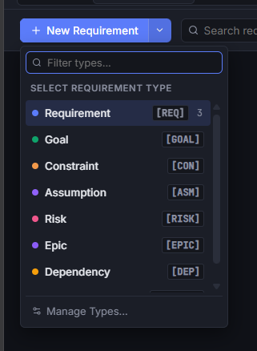
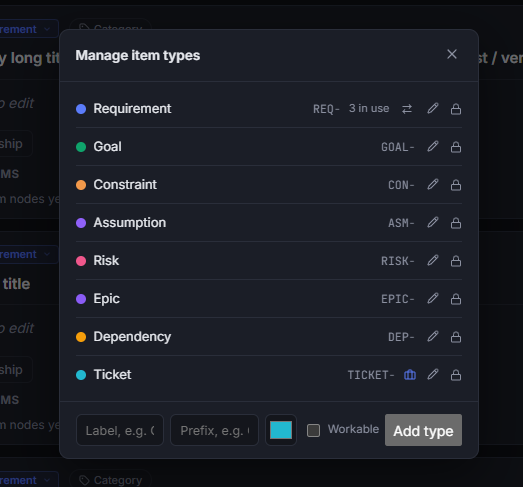
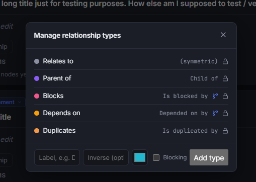
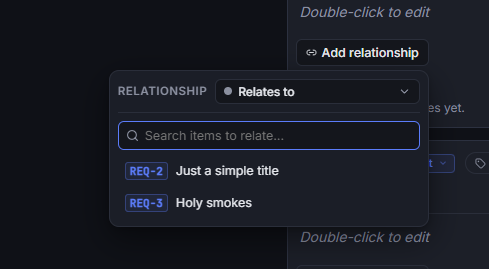
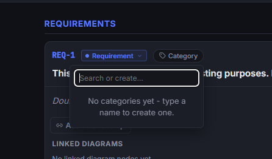
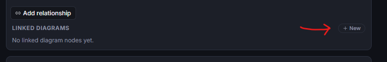

# Requirements Management

The **Requirements** module provides a structured, searchable, and collaborative system for managing architectural specifications, engineering requirements, constraints, goals, and delivery tickets. It bridges the gap between high-level architectural designs and low-level task tracking by enabling bi-directional traceability directly on the diagram canvas.

---

## 1. Creating & Editing Requirements

Every item in the requirements catalog represents a specific architectural artifact or engineering task with a persistent, unique identifier.

### Adding a Requirement Item

1. Click the **+ Requirement** (or dropdown arrow) in the top toolbar.
2. Select the type of item to create (e.g., _Requirement_, _Goal_, _Constraint_, _Risk_, _Ticket_, or custom types).
3. The new item is generated with an automatic, sequential ID (such as `REQ-1`, `GOAL-1`, `CON-1`, or `TICKET-1`).
4. Enter a descriptive title and double-click the body area to write specifications.

### Workable Items vs. Descriptive Items

The requirements engine distinguishes between two fundamental classes of artifacts:

- **Descriptive Artifacts** (_Requirements_, _Goals_, _Constraints_, _Assumptions_, _Risks_, _Epics_): Focus on documenting intent, design constraints, and technical scope.
- **Workable Artifacts** (_Tickets_ or custom workable types): Represent actionable work items. These surface additional planning controls:
  - **Status Picker**: Track progress across `To Do`, `In Progress`, and `Done`.
  - **Story Points**: Estimate effort using point values.
  - **Sprint / Program Increment**: Schedule work into active team sprints.
  - **Assignee**: Assign team members directly from the project team roster.

---

## 2. Managing Types & Relationships

Requirements rarely exist in a silo. The editor supports extensible item types and directional relationships to model dependencies and hierarchy.

### Managing Item Types

Click **Types** in the toolbar to open the item type manager.

- **Built-in Types**: Default types include _Requirement (`REQ`)_, _Goal (`GOAL`)_, _Constraint (`CON`)_, _Assumption (`ASM`)_, _Risk (`RISK`)_, _Epic (`EPIC`)_, _Dependency (`DEP`)_, and _Ticket (`TICKET`)_.
- **Custom Types**: Define your own item types with custom labels, ID prefixes (e.g., `SEC` for Security), badge colors, and workable status toggles.
- **Color Coding**: Each type has a distinct color used across requirement cards, diagram badges, and filter views.

### Managing Relationship Types

Click **Relationships** in the toolbar to view and customize relationship types.

- **Relationship Semantics**: Define directed relationships with forward and inverse labels (e.g., `Blocks` / `Is blocked by`, `Parent of` / `Child of`, `Depends on` / `Depended on by`, `Relates to`, `Duplicates`).
- **Dependency & Cycle Prevention**: Relationship types marked as **Blocking** participate in automatic cycle detection, preventing circular dependency chains (e.g., `A blocks B blocks C blocks A`).

### Linking Items Together

Inside any requirement card, expand the relationship section to establish links between items.

1. Select the relationship type (e.g., _Blocks_, _Depends on_, _Parent of_).
2. Search and select the target requirement item by ID or title.
3. The relationship appears on both items automatically, displaying the proper forward or inverse label.
4. Click any linked item ID to jump directly to that requirement card.

---

## 3. Categorization & Grouping

Organize large requirement catalogs into functional domains and toggle view layouts.

### Assigning Categories

- Click the **Category** pill on any requirement card.
- Select an existing category or type a new name to create and assign it immediately.
- Categories help group requirements by functional subsystem (e.g., _Authentication_, _Payments_, _Data Pipeline_, _Infrastructure_).

### Grouping Views

Toggle between two organization modes using the toolbar controls:

- **Group by Type**: Groups items by their artifact type (_Requirements_, _Goals_, _Tickets_, etc.).
- **Group by Category**: Groups items by assigned functional category, with an _Uncategorized_ section for unsorted items.

---

## 4. Rich Markdown & Cross-References

Requirement descriptions support full GitHub Flavored Markdown (GFM) alongside inline reference linking.

### Markdown Capabilities

- **Formatting**: Headers, bold, italics, strikethrough, blockquotes, and ordered/unordered lists.
- **Tables & Task Lists**: Create comparison tables and task checklists (`- [x] Done`).
- **Code Blocks**: Formatted syntax blocks for schemas, JSON payloads, and API signatures.
- **Soft Breaks**: Intuitive newline handling without requiring double trailing spaces.

### Cross-Referencing Items (`#REQ-ID`)

- Type `#` in the markdown editor to trigger auto-complete for any existing requirement ID.
- The editor resolves references like `#REQ-1` or `#TICKET-4` into interactive navigation buttons.
- Clicking a reference in rendered markdown instantly scrolls to and highlights the target requirement card.

---

## 5. Searching & Quick Navigation

The toolbar search filter provides fast lookup across the entire requirements repository.

- **Multi-Field Search**: Filters items instantly by ID, title text, body content, and category name.
- **Match Counter & Navigation**: Displays matching result counts (`3 of 12`) with `▲` Prev and `▼` Next buttons.
- **Keyboard Shortcuts**:
  - `Ctrl + F` / `Cmd + F`: Focus the search input.
  - `Enter` / `F3` / `Cmd + G`: Jump to next match.
  - `Shift + Enter` / `Shift + F3`: Jump to previous match.
  - `Escape`: Clear search query.
- **Visual Highlight**: Matched terms are highlighted across card headers and descriptions.

---

## 6. Diagram Traceability & Linked Nodes

The requirements view is tightly integrated with the diagram canvas, ensuring every architectural decision maps to concrete system requirements.

### Viewing Connected Components

Each requirement card includes a **Linked Diagrams & Components** section displaying all canvas nodes associated with that requirement.

- Click any linked component pill to switch directly to the diagram view, automatically navigating to and framing that node (even inside nested sub-diagrams).

### Adding Requirements Directly to the Canvas

- In the **Linked Diagrams** section, click **+ Add to diagram** (or **+ New linked node**).
- This creates a new node on the active diagram canvas that is pre-linked to the requirement.
- Alternatively, you can link existing canvas nodes from the diagram's Inspector panel (see [Diagrams Guide](/guide/diagram#linking-to-requirements)).

---

## 7. Collaborative Editing & Presence

When collaborating in real-time sessions:

- **Active Editors**: Visual peer avatar dots indicate when another team member is actively editing a specific requirement.
- **Live Sync**: Changes to titles, descriptions, categories, and relationships synchronize across connected peers with automatic conflict resolution.
