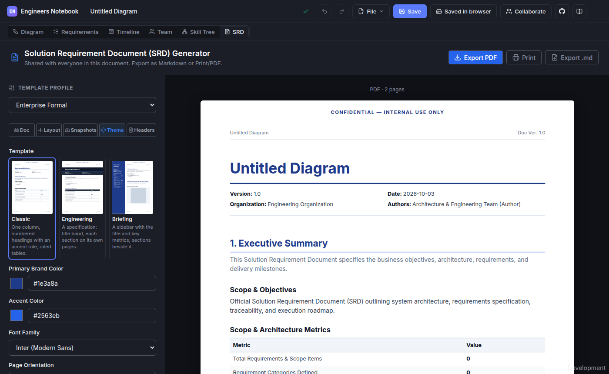
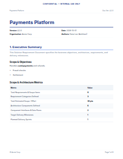
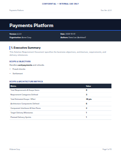
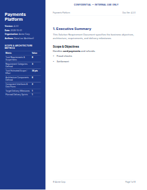

# Solution Requirement Documents

The **SRD** view turns your document - its architecture diagram, requirements, relationships, milestones, and sprints - into a **Solution Requirement Document**: a formatted PDF you can share, print, or attach to a review. It updates as the document changes, and its settings are part of the document, so everyone working on it sees and prints the same thing.

---

## 1. Opening the SRD

Click **SRD** in the view switcher at the top of the editor. The view has two parts:

- **The editing panel** on the left, with tabs for the document's details, its layout, snapshots, theme, and headers and footers.
- **The preview** on the right. This is the PDF itself, page by page - what you see is exactly what **Export PDF** downloads.

The preview refreshes a moment after each change. While it renders, the line above the pages says so; when it is done, it shows the page count.

---

## 2. Templates

A **template** decides how the document looks and how its pages are laid out. Every template shows the same content - only the presentation differs. Choose one in the **Theme** tab.

|                             Classic                              |                                Engineering                                 |                                                       Briefing                                                        |
| :--------------------------------------------------------------: | :------------------------------------------------------------------------: | :-------------------------------------------------------------------------------------------------------------------: |
|                             |                               |                                                                                |
| One column, numbered headings with an accent rule, ruled tables. | A specification: a title band, and each section starting on its own pages. | An opening page with a colored sidebar of the title, details, and key metrics; the pages after it use the full width. |

### Templates and presets

The **Template Profile** menu at the top of the panel applies a **preset**: a starting set of settings - sections, colors, headers - that you can then adjust. A template is how those settings are drawn, so switching templates keeps your settings, and adjusting a setting keeps your template.

To reuse settings in another document, use the template **export** and **import** controls: they save and load the settings as a small JSON file.

### A template this version does not have

A document saved by a newer version of the app may use a template this version does not know. The SRD view then says so, names the template, and shows the document with Classic. Nothing is lost: saving keeps the original choice, so the newer version still shows it as intended. Choosing a template replaces it.

---

## 3. Customizing the Document

### Details (Doc tab)

Edit the title, description, version, date, organization, and authors shown on the first page. The description supports Markdown - lists, tables, emphasis, code, and links.

### Sections and layout (Layout tab)

- **Turn sections on or off**, and **reorder** them.
- Give each section an **introduction**, shown under its heading.
- Show requirements as **cards** (with their snapshot, linked components, body, and dependencies) or as a compact **table**.
- Include or leave out the **component inventory** and the **connections** table.

### Theme

Choose the primary and accent colors, the font, the page orientation, and whether tables are compact.

### Headers and footers

Set a classification banner (printed at the top of every page) and text for the left and right of the header and footer. These can include tokens, filled in on each page:

| Token                              | Becomes                                  |
| ---------------------------------- | ---------------------------------------- |
| `{{title}}`                        | The document title                       |
| `{{version}}`                      | The version                              |
| `{{generatedAt}}`                  | The document's date                      |
| `{{organization}}`                 | The organization                         |
| `{{pageNumber}}`, `{{totalPages}}` | The page number, and the number of pages |
| `{{year}}`                         | The current year, when the PDF is made   |

If the right-hand footer is empty, pages are numbered "Page _n_ of _N_" (turn this off with the page-number setting).

---

## 4. Snapshots

The SRD includes a picture of the **architecture diagram**, and for each requirement linked to diagram nodes, an **architecture context snapshot** of the part of the diagram it concerns. They are made automatically, in the background, from the current diagram - and made again whenever the diagram changes. Making them never moves your own view of the canvas.

In the **Snapshots** tab you can, for each requirement:

- **Frame** its snapshot - pan and zoom - with the sliders; the panel previews the change as you drag.
- **Remove** it from the document, and bring it back by framing it again.

The architecture diagram can be removed and restored from the **Doc** tab.

Framing and removal are part of the document, so collaborators see the same snapshots. Each person's app renders them from the shared framing, so on different computers they may differ by a pixel or two.

---

## 5. Exporting and Printing

- **Export PDF** downloads the PDF shown in the preview.
- **Print** opens the PDF in your browser's PDF viewer, ready to print. In the SRD view, **Ctrl+P** (**Cmd+P** on macOS) does the same.
- **Export .md** downloads the document as Markdown, for wikis and repositories.

Because the SRD's settings are part of the document, the same document makes the same PDF for everyone who opens it.
