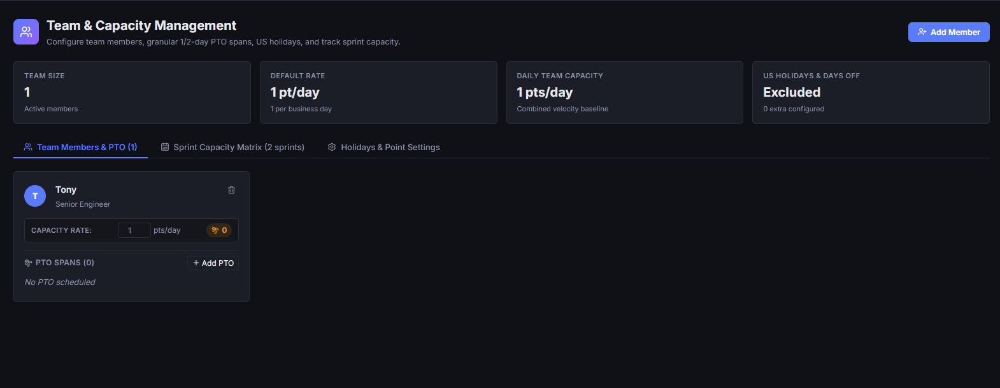
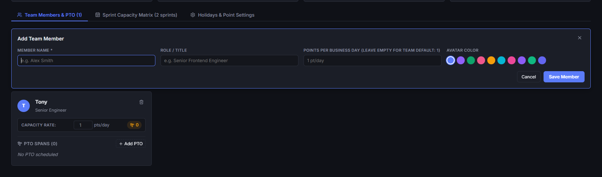
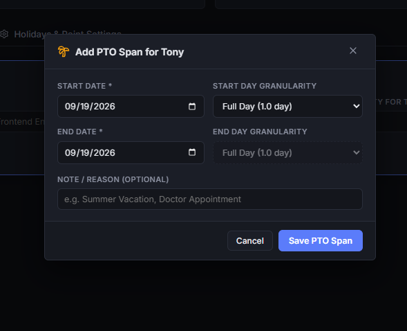
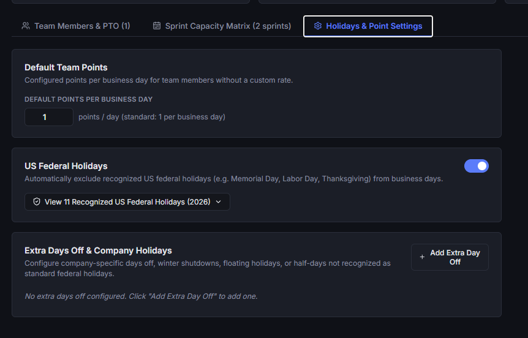
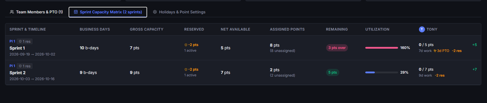

# Team & Capacity Management

The **Team** module provides a centralized roster and capacity planning engine. It enables engineering teams to accurately forecast velocity and available bandwidth by modeling individual team members, customized daily output rates, planned Paid Time Off (PTO), organizational holidays, and sprint-by-sprint capacity matrices.

---

## 1. Managing Team Members & Output Rates

Building an accurate capacity model starts with maintaining your engineering roster and configuring baseline productivity metrics.

### Adding Team Members
1. In the **Team** view, navigate to the **Members** tab and click **+ Member**.
2. **Name & Role**: Enter the member's full name and optional engineering role (e.g., *Frontend Engineer*, *Staff Architect*, *QA Lead*).
3. **Avatar Color**: Choose a distinct avatar accent color from the palette for easy visual identification across ticket cards and presence indicators.
4. **Daily Points Override**:
   - By default, members inherit the global baseline output rate (typically `1.0` point per business day).
   - Enter a custom value (e.g., `0.8` for part-time engineers or onboarding teammates, or `1.2` for dedicated individual contributors) to override their daily capacity.
5. Click **Add Member** to save.

### Team Summary Metrics
The top of the Team view displays live aggregate metrics:
- **Total Members**: Active roster count.
- **Daily Output**: Total collective story points generated by the team per standard business day.

---

## 2. Managing Paid Time Off (PTO)

Individual time off directly impacts sprint delivery commitments. The Team module provides fine-grained PTO tracking with automatic capacity adjustments.

### Logging Member PTO
1. Locate the team member in the **Members** tab and click **+ Add PTO** on their card.
2. **Date Range**: Select the start and end dates for the planned absence.
3. **Half-Day Granularity**:
   - **Full Day** (`1.0` day): Member is away for the entire business day.
   - **Morning** (`0.5` day): Member is away during the first half of the day.
   - **Afternoon** (`0.5` day): Member is away during the second half of the day.
   - Support for independent half-day granularity on both the start date and end date allows accurate scheduling for travel days or partial leaves.
4. **Notes**: Add optional context (e.g., *Vacation*, *Training*, *Conference*).
5. Click **Record PTO**.

### Dynamic Capacity Updates
- PTO spans exclude intervening weekends and organizational holidays automatically.
- Total recorded PTO days are computed and deducted in real time from every sprint that overlaps with the absence span.
- Members' cards display a badge list of all upcoming PTO bookings with quick deletion options (`🗑️`).

---

## 3. Organization Holidays & Work Settings

Configure global organization-level calendar settings, federal holidays, and custom company-wide closures.

### Configuring Global Settings
Navigate to the **Settings** tab to manage organization defaults:
- **Default Points per Day**: Set the baseline points expected per business day for members without an individual override (default is `1.0`).
- **US Federal Holidays**:
  - Toggle **Exclude US Federal Holidays** to automatically subtract all 11 official US federal holidays from working business day totals.
  - Includes standard observance rules (Saturday holidays observed on Friday, Sunday holidays observed on Monday).
  - Click **View preview** to inspect the full list of holidays calculated for the active year (e.g., *New Year's Day*, *MLK Day*, *Memorial Day*, *Juneteenth*, *Independence Day*, *Labor Day*, *Thanksgiving*, *Christmas*).

### Custom Extra Days Off
For company retreats, regional holidays, mental health recharge days, or year-end shutdowns:
1. Under **Organization Extra Days Off**, click **+ Add Day Off**.
2. Enter the holiday name (e.g., *Company Summit*, *Winter Shutdown Day 1*), the calendar date, and optional notes.
3. Toggle **Half-day off (0.5 day)** if the event represents a partial business day.
4. Click **Save Day Off**. All sprints encompassing this date immediately decrement working business days across the entire team.

---

## 4. Sprint Capacity Matrix

The **Capacity Matrix** tab aggregates member schedules, holidays, sprint dates, and capacity reservations into a single real-time matrix across all Program Increments.

### Sprint Summary Columns
The matrix organizes each planned sprint into an actionable breakdown:
- **Sprint & Dates**: Sprint name, parent Program Increment, calendar date span, and total calendar duration.
- **Business Days**: Calculated working days (Mon–Fri) after subtracting federal holidays and organization extra days off.
- **Gross Capacity**: Total raw team capacity (`Working Days × Daily Points`).
- **Reserved Points**: Story points deducted for operational overhead, risk buffers, bug triage, or technical debt (configured via [Timeline Reservations](/guide/timeline#configuring-capacity-reservations)).
- **Net Capacity**: Actual available bandwidth for assigned engineering work (`Gross Capacity − Reserved Points`).
- **Assigned Points & Items**: Total story points and ticket count scheduled into that sprint.
- **Remaining Capacity**: Unallocated points available for additional work.
- **Utilization Status**: Visual progress bar indicating load percentage (e.g., *Optimal*, *Under-allocated*, or *Over-allocated*).

### Per-Member Breakdown
Expand any sprint row (`▼`) to inspect individual developer capacity:
- **Available Days & PTO**: Exact working days available after member-specific PTO deductions.
- **Allocated Story Points**: Story points assigned to that specific team member in the sprint.
- **Individual Remaining**: Remaining bandwidth per engineer to prevent individual workload bottlenecks.

---

## 5. Timeline & Planning Integration

The team capacity engine directly powers the planning views across the application:
- **Live Sprint Gauges**: Sprint columns in the [Timeline Board](/guide/timeline) reflect net capacity derived from team roster sizes and PTO.
- **Assignment Drawer**: Selecting assignees on requirement cards and sprint tickets draws directly from the active team roster.
- **Over-Allocation Alerts**: Visual warnings alert planners when assigned ticket points exceed available net capacity for a sprint or individual contributor.

---

## 6. Real-Time Collaborative Sync

Like all modules in System Design Editor, team data synchronizes seamlessly across distributed peers:
- **Zero-Conflict CRDTs**: Roster updates, PTO bookings, and calendar changes merge instantaneously over peer-to-peer WebRTC connections.
- **Live Feedback**: Capacity adjustments made by team leads or project managers immediately reflect on all connected teammates' screens during live sprint planning ceremonies.