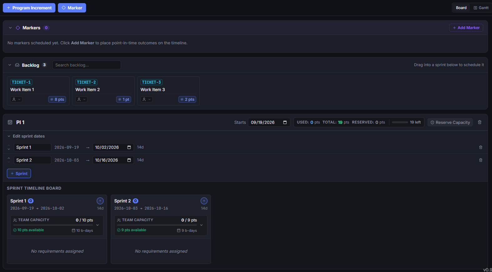
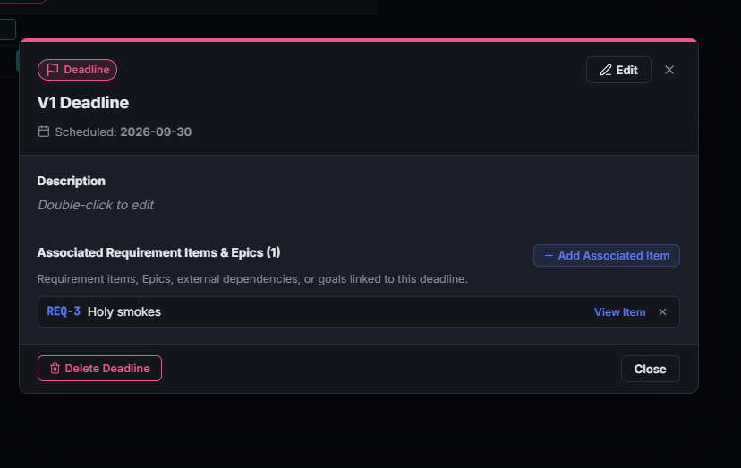
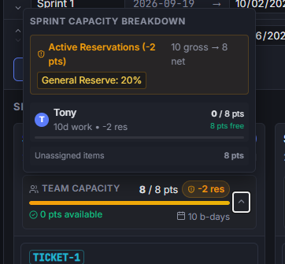
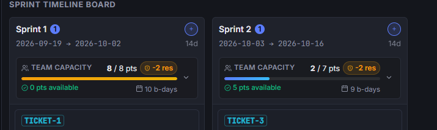
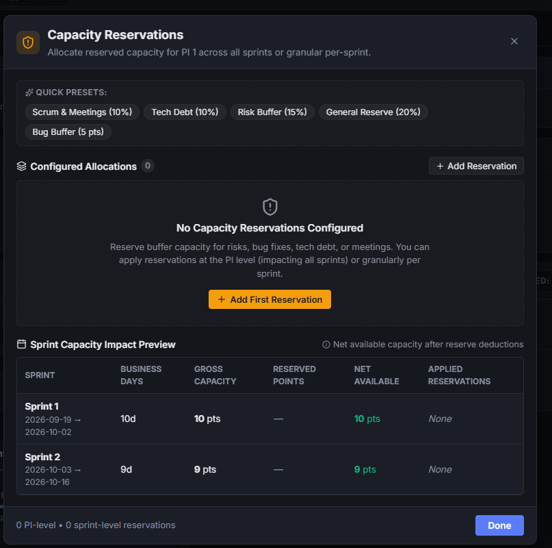
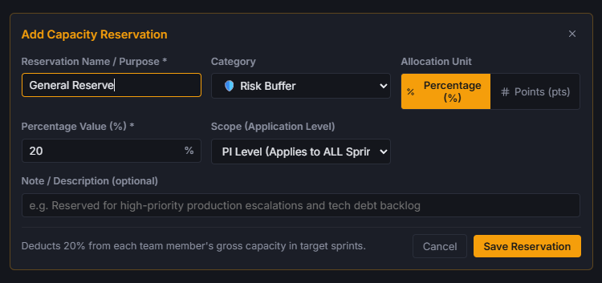
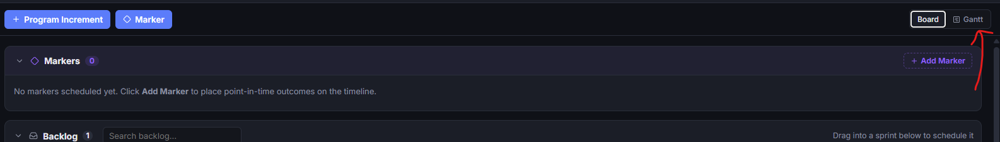
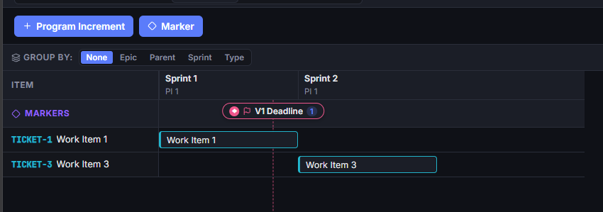
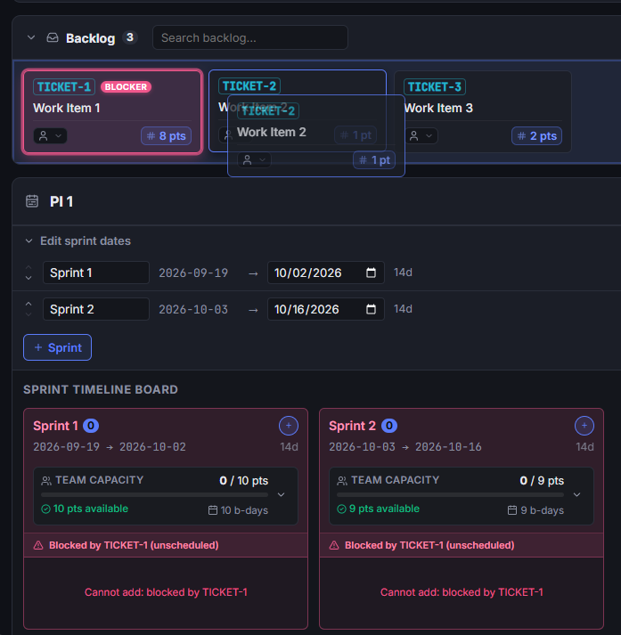
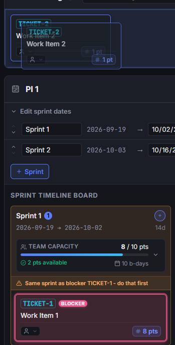

# Timeline & PI Planning

The **Timeline** module provides a collaborative Program Increment (PI) planning and sprint scheduling engine. Designed for agile engineering teams, it bridges high-level architectural roadmaps with tactical delivery schedules by combining drag-and-drop sprint boards, real-time team capacity management, date-based milestones, and interactive Gantt charts.

---

## 1. Program Increments & Sprints

Program Increments (PIs) provide multi-sprint planning intervals (typically 8–12 weeks) that align engineering delivery with architectural milestones.

### Adding a Program Increment
1. In the Timeline toolbar, click **+ Program Increment** (or **+ PI**).
2. The editor automatically initializes a new planning interval (e.g., `PI 1`, `PI 2`) starting seamlessly on the day following the previous PI's conclusion.
3. Sprints within the PI default to standard two-week (14-day) durations.

### Sprint Management & Cascading Dates
- **Adding Sprints**: Click **+ Sprint** on any PI to add subsequent sprints.
- **Adjusting Durations**: Modify a sprint's end date directly from the sprint header date picker.
- **Automatic Cascading**: Start and end dates for subsequent sprints automatically adjust when an earlier sprint is lengthened or shortened, keeping the timeline perfectly contiguous without manual re-calculation.

---

## 2. Milestones & Date-Based Markers

Milestones represent critical temporal events, releases, regulatory checkpoints, and architectural gates across the delivery timeline.

### Creating a Milestone Marker
1. Click **+ Marker** in the timeline toolbar or click the milestone indicator on any sprint column.
2. Select the milestone category:
   - **Release** (`📦`): Planned software or capability release.
   - **Deadline** (`🚩`): Contractual, regulatory, or external target deadline.
   - **Review** (`📋`): Architecture, security, or stakeholder review gate.
   - **Launch** (`🚀`): Production go-live or public deployment.
   - **Code Freeze** (`❄️`): Stabilization cutoff date prior to deployment.
   - **PI Boundary** (`📅`): Planning interval transition marker.
3. Enter a title, scheduled calendar date, optional version tag (e.g., `v2.4.0`), and descriptive markdown notes.
4. Associate specific requirement items or delivery tickets with the milestone.

Milestones appear as distinctive colored point-in-time indicators on sprint headers and Gantt chart timelines.

---

## 3. Workable Item Assignment & Scheduling

The timeline board features a backlog drawer for scheduling unassigned actionable items (*Tickets*, *Workable Requirements*, etc.) into target sprints.

### Scheduling Items
- **Backlog Drawer**: Open the **Backlog** drawer on the left to view all unassigned workable items.
- **Drag-and-Drop**: Drag tickets directly from the backlog into any sprint column, or drag items between sprints to re-sequence work.
- **Inline Editing**: Set story point estimates, update status (`To Do`, `In Progress`, `Done`), and assign team members directly on the sprint card.

### Real-Time Impact Preview
When dragging items across the board, the drop target displays a live impact preview.

The preview highlights projected point totals, updated capacity percentages, and immediate warning badges if the assignment introduces dependency order violations.

---

## 4. Capacity Planning & Reservations

Effective PI planning requires accounting for operational overhead, maintenance, and uncertainty rather than allocating 100% of raw developer bandwidth to new features.

### Configuring Capacity Reservations
Click **Reservations** on any PI to configure capacity buffers.

- **Reservation Units**: Allocate buffers as **Story Points** or as a **Percentage of Total Capacity** (e.g., `20%`).
- **Categories**: Tag reservations for specific operational needs:
  - **Risk Buffer**: Absorbs scope discovery and estimation variance.
  - **Bugs & Maintenance**: Accounts for incoming defect triage and production support.
  - **Technical Debt**: Dedicated refactoring, dependency upgrades, and infrastructure hardening.
  - **Meetings & Ceremonies**: Sprint planning, demos, and organizational overhead.
- **Scope**: Apply reservations globally across all sprints in the PI, or target individual sprints (e.g., reserving extra hardening capacity during a pre-release sprint).

### Live Sprint Capacity Bar
Every sprint column displays a live capacity gauge comparing planned story points against available net capacity. The bar updates dynamically as tickets are added, resized, or reassigned.

---

## 5. Board View vs. Gantt Chart View

The timeline provides dual viewing modes tailored for sprint-level execution and executive roadmapping.

### Switching Modes
Click the view toggle in the toolbar to switch between:
- **Board View**: Columnar view organized by Program Increment and Sprint, optimized for backlog grooming and card dragging.
- **Gantt Chart**: Horizontal timeline visualizing work streams, epics, and milestone deadlines across months and quarters.

### Inferred Epic Scheduling
The Gantt chart automatically computes start and end spans for high-level Epics based on the scheduled dates of their underlying child tickets:
- **Automatic Date Spans**: An Epic's timeline bar spans from the start of its earliest child ticket's sprint to the conclusion of its latest child ticket's sprint.
- **Epic Filtering**: Use the Epic filter dropdown in the toolbar to isolate a single initiative across the timeline.

---

## 6. Dependency & Blocker Visualization

Scheduling mistakes, such as scheduling a dependent ticket before its prerequisite is completed, are flagged automatically.

- **Schedule Conflict Warnings**: If Ticket B depends on Ticket A, but Ticket B is placed in an earlier sprint than Ticket A, the system flags the conflict with a visual warning badge (`⚠️`).
- **Risk Indicators**: Hovering over conflict badges displays the exact relationship chain and recommends re-scheduling adjustments.

---

## 7. Collaborative PI Planning

During team-wide PI planning sessions, multiple engineers, architects, and product managers can work on the timeline simultaneously:
- **Live Peer Presence**: Colored presence avatars on sprint cards and detail modals show which items other participants are currently inspecting or editing.
- **Zero-Conflict Sync**: Sprint re-ordering, ticket assignments, and capacity adjustments propagate instantaneously across all connected clients via peer-to-peer WebRTC signaling.